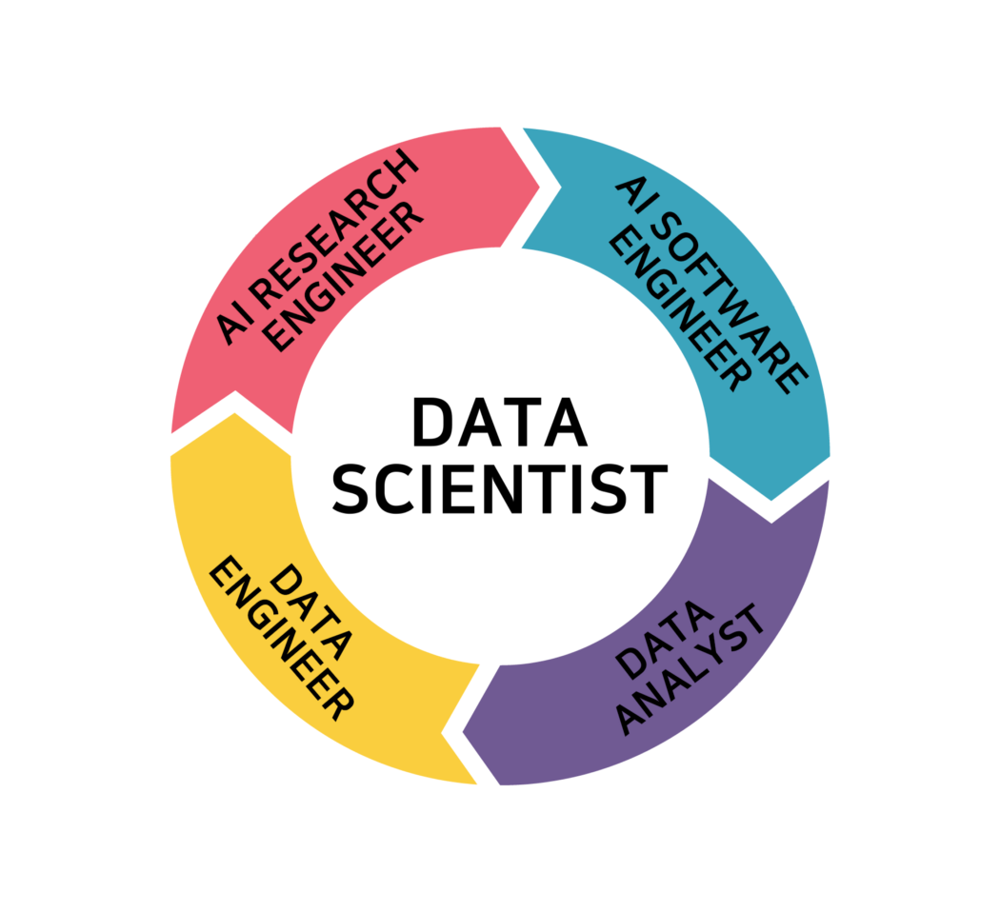

# Learning_DSbasic
 Minso Jeong, MOOC Data Scientist 기본
 

## Schedule
|          날짜         |   학습 내용     |   비고   |
|:---------------:|---------------|--------------------------|
| 2020. 11. 09 | 1-1. Python 환경 setting   1-2. Python 기초 |  |
| 2020. 11. 10 | 2. 데이터 전처리 | pandas |
| 2020. 11. 11 | 3. 데이터 전처리 |  |
| 2020. 11. 12 | 4-1. 데이터 시각화   4-2. test |  |

## Setting
* anaconda 설치 (https://www.anaconda.com/products/individual)
* pycharm 설치 (https://www.jetbrains.com/ko-kr/pycharm)
* 필수 라이브러리
    * pandas
    * numpy
    * xlrd
    * pymysql
     
## Data
* day2 - day02_assignment.ipynb
    * titanic.csv (https://www.kaggle.com/c/titanic)
    * 출처의 data modify한 것
    
## References
* DS_main image - [link](https://medium.com/@learningspoons/01-%EB%8D%B0%EC%9D%B4%ED%84%B0-%EC%82%AC%EC%9D%B4%EC%96%B8%EC%8A%A4-%EC%BB%A4%EB%A6%AC%EC%96%B4-%EB%A1%9C%EB%93%9C%EB%A7%B5-ff5f1c8803f6)

